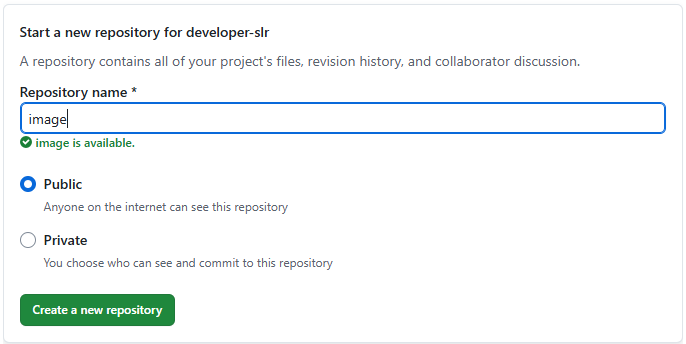
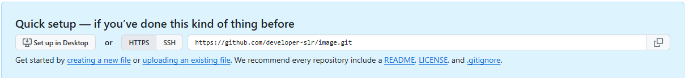
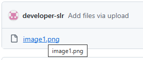
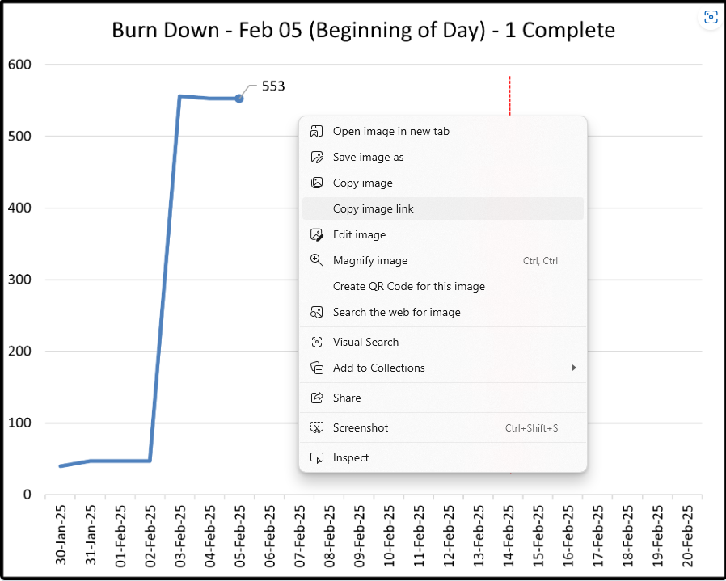

# How to set up images in github

1. Create a github account
2. Click the Sign up button

  
###
 
3. Fill in the details
   ###
   
   
4. Solve a visual or audio puzzle
5. Confirm your email address by entering code
6. Sign in to continue
7. Create a new public repository
   ###
    
8. Click the uploading an existing file link
    
9. Drag the file from file explorer to the drag drop frame
10. Commit changes
11. Select the image
    ###
    
12. Right click and select copy image link to grab the url to the clipboard
    ###
    
13. Paste the URL in address bar and copy new direct url back on to the clipboard. This is the link that will be entered in the database for Power BI.
    ###

## (Optional) Set up a server in git

1. From the repository select the settings button from the top menu
   ###
   
2. 

